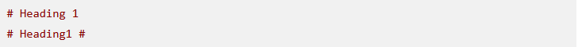
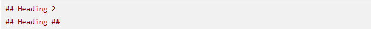
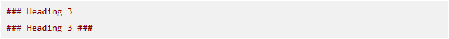

# Tìm hiểu ngôn ngữ MarkDown #

## Mục Lục ##
- [I.Giới thiệu Markdown](##I.Giới-thiệu-Mardown)
    - [1.1 Markdown là gì ?](###1.1-markdown-là-gì-?)
    - [1.2 Tại sao nên dùng markdown ?](###1.2-tại-sao-nên-dùng-markdown-?)
- [II.Cách dùng Markdown ](##II.Cách-dùng-Markdown)

## I . Giới thiệu Markdown ##
### 1.1 Markdown là gì ? ###

Markdown là một ngôn ngữ đánh dấu (markup language) được thiết kế để tạo ra tài liệu có
nội dung và hình ảnh.

### 1.2 Tại sao nên dùng markdown ? ###

Markdown được sử dụng rộng rãi trong cộng đồng lập trình và viết blog vì
nó cung cấp một cách dễ dàng để tạo ra tài liệu có nội dung và hình ảnh.

## II . Cách dùng Markdown ##
### 2.1 Dùng cho Heading ###
- Heading là một phần quan trọng trong Markdown, nó giúp phân chia nội dung
- Dùng `#` để tạo ra heading
- Ví dụ: `# Heading 1`

- Ví dụ: `## Heading 2`

- Ví dụ: `### Heading 3`

### 2.2 Dùng cho Text ###

