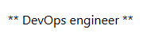
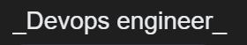

# Tìm hiểu ngôn ngữ MarkDown #

## Mục Lục ##
- [I.Giới thiệu Markdown](##I.Giới-thiệu-Mardown)
    - [1.1 Markdown là gì ?](###1.1-markdown-là-gì-?)
    - [1.2 Tại sao nên dùng markdown ?](###1.2-tại-sao-nên-dùng-markdown-?)
- [II.Cách dùng Markdown ](##II.Cách-dùng-Markdown)
    - [2.1 Dùng cho Heading](###2.1-Dùng-cho-Heading)
    - [2.2 Dùng cho Text](###2.2-Dùng-cho-Text)
- [Tài liệu tham khảo](##Tài-liệu-tham-khảo)

## I . Giới thiệu Markdown ##
### 1.1 Markdown là gì ? ###

Markdown là một ngôn ngữ đánh dấu (markup language) được thiết kế để tạo ra tài liệu có
nội dung và hình ảnh.

### 1.2 Tại sao nên dùng markdown ? ###

Markdown được sử dụng rộng rãi trong cộng đồng lập trình và viết blog vì
nó cung cấp một cách dễ dàng để tạo ra tài liệu có nội dung và hình ảnh.

## II . Cách dùng Markdown ##
### 2.1 Dùng cho Heading ###
- Heading là một phần quan trọng trong Markdown, nó giúp phân chia nội dung
- Dùng `#` để tạo ra heading
- Ví dụ: `# Heading 1`   

- Ví dụ: `## Heading 2`  

- Ví dụ: `### Heading 3`  

### 2.2 Dùng cho Text ###
Sử dụng ** ở đầu (hoặc đầu và cuối câu) nếu muốn bôi đậm câu đó.

** Tạo chữ Bold **     
  
Hiển thị: ** DevOps Engineer **

** Tạo chữ Italic **
Sử dụng _ ở đầu hoặc * (hoặc đầu và cuối câu) nếu muốn in nghiêng câu đó.  
  
Hiển thị: _Devops engineer_

## Tài liệu tham khảo ##
[Viblo](https://viblo.asia/helps/cach-su-dung-markdown-bxjvZYnwkJZ)

