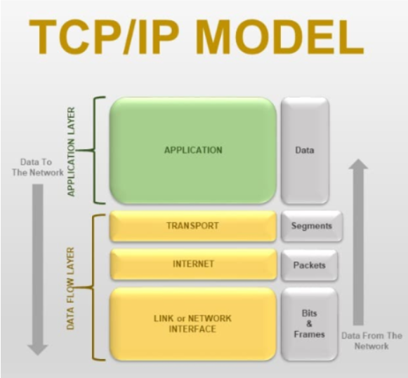
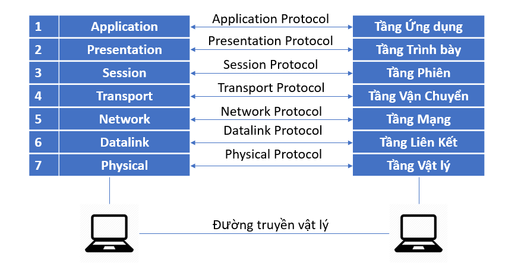

# So sánh mô hình OSI và mô hình TCP/IP #
# Mục Lục #
-[I.Mô hình OSI (Open System Interconnection)](###I.Mô-hình-OSI-(Open-System-Interconnection))
-[II.Mô hình TCP/IP](###II.Mô-hình-TCP/IP(Transmission-Control-Protocol/Internet-Protocol))
-[III.So sánh giữa mô hình OSI và mô hình TCP/IP](###III.So-sanh-giữa-mô-hình-OSI-và-mô-hình-TCP/IP)
### I.Mô hình OSI (Open System Interconnection) ###
**Khái niệm:**
Mô hình OSI (Open Systems Interconnection) là một mô hình tham chiếu gồm bảy lớp, được thiết kế để tiêu chuẩn hóa các giao thức mạng và giúp cho các hệ thống mạng khác nhau có thể giao tiếp với nhau.
**Các lớp trong mô hình OSI**
1. **Lớp 1: Layer 1 - Lớp vật lý (Layer 1 - LayerPhysical)**: Đây là lớp thấp nhất của mô hình OSI, chịu trách nhiệm truyền dẫn tín hiệu
2. **Lớp 2: Layer 2 - Lớp liên kết dữ liệu (Layer 2 -Layer Data Link)**: Chịu trách nhiệm truyền dẫn dữ liệu giữa các thiết bị trong cùng mạng
3. **Lớp 3: Layer 3 - Lớp mạng (Layer 3 - Layer Network)**: Chịu trách nhiệm truyền dẫn dữ liệu giữa các mạng
4. **Lớp 4: Layer 4 - Lớp Giao Vận (Layer 4 - Layer Transport)**: Chịu trách nhiệm truyền dẫn dữ liệu giữa các ứng dụng
5. **Lớp 5: Layer 5 - Lớp phiên (Layer 5 - Layer Session)**: Chịu trách nhiệm thiết lập và quản lý các phiên kết nối giữa các ứng dụng
6. **Lớp 6: Layer 6 - Lớp trình bày (Layer 6 - Layer Presentation)**: Chịu trách nhiệm chuyển đổi dữ liệu từ định dạng
thứ tự bit sang định dạng thứ tự byte
7. **Lớp 7: Layer 7 - Lớp ứng dụng (Layer 7 - Layer Application)**: Chịu trách nhiệm cung cấp các dịch vụ ứng dụng cho người dùng

### II.Mô hình TCP/IP (Transmission Control Protocol/Internet Protocol) ###
**Khái niệm:**
Mô hình TCP/IP (Transmission Control Protocol/Internet Protocol) là một mô hình tham chiếu gồm
ba lớp, được thiết kế để tiêu chuẩn hóa các giao thức mạng và giúp cho các hệ thống
năng khác nhau có thể giao tiếp với nhau.
**Các lớp trong mô hình TCP/IP**
1. **Lớp 1: Lớp Liên Kết Dữ Liệu (Lớp 1: Link Player)**:Quản lý việc truyền tải dữ liệu qua các phương tiện truyền thông vật lý như cáp, sóng vô tuyến, hoặc các liên kết mạng khác.
2. **Lớp 2: Lớp Mạng (Lớp 2: Internet)**: Định tuyến các gói dữ liệu từ nguồn đến đích qua các mạng khác nhau. Lớp này sử dụng địa chỉ IP để xác định địa chỉ của các thiết bị mạng.
3. **Lớp 3: Lớp Giao Vận (Lớp 3: Transport)**: Cung cấp các dịch vụ truyền dữ liệu đáng tin cậy giữa các ứng dụng. Lớp này đảm bảo rằng dữ liệu được truyền đến đúng đích và đúng thứ tự.
4. **Lớp 4: Lớp Ứng Dụng (Lớp 4: Application)**: Cung cấp các dịch vụ ứng dụng cho người dùng, bao gồm các giao
thức như HTTP, FTP, SMTP, v.v.

### III. So sánh mô hình OSI và mô hình TCP/IP ###
**Khác biệt:**
- Mô hình OSI có 7 lớp, trong khi mô hình TCP/IP có 4 lớp
- Mô hình OSI tập trung vào việc tiêu chuẩn hóa các giao thức mạng, trong khi mô
hình TCP/IP tập trung vào việc cung cấp các dịch vụ ứng dụng cho người dùng
- Mô hình OSI có các lớp riêng biệt cho mỗi chức năng, trong khi mô hình TCP
/IP có các lớp chồng lên nhau