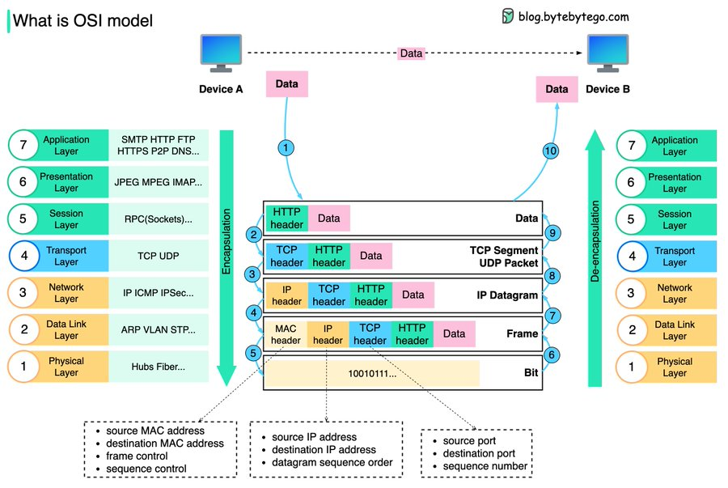
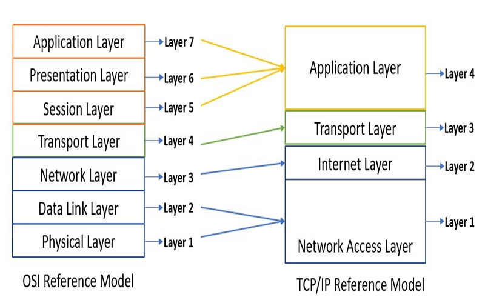

# So sánh mô hình OSI và mô hình TCP/IP #
## Mục Lục ##
- [I.Mô hình OSI (Open System Interconnection)](###I.Mô-hình-OSI)
- [II.Mô hình TCP/IP](###II.Mô-hình-TCP/IP)
- [III.So sánh giữa mô hình OSI và mô hình TCP/IP](###III.So-sanh-giữa-mô-hình-OSI-và-mô-hình-TCP/IP)
### I.Mô hình OSI (Open System Interconnection) ###
**Khái niệm:**
Mô hình OSI (Open Systems Interconnection) là một mô hình tham chiếu gồm bảy lớp, được thiết kế để tiêu chuẩn hóa các giao thức mạng và giúp cho các hệ thống mạng khác nhau có thể giao tiếp với nhau.
**Các lớp trong mô hình OSI**
1. **Lớp 1: Layer 1 - Lớp vật lý (Layer 1 - LayerPhysical)**: Đây là lớp thấp nhất của mô hình OSI, chịu trách nhiệm truyền dẫn tín hiệu
2. **Lớp 2: Layer 2 - Lớp liên kết dữ liệu (Layer 2 -Layer Data Link)**: Chịu trách nhiệm truyền dẫn dữ liệu giữa các thiết bị trong cùng mạng
3. **Lớp 3: Layer 3 - Lớp mạng (Layer 3 - Layer Network)**: Chịu trách nhiệm truyền dẫn dữ liệu giữa các mạng
4. **Lớp 4: Layer 4 - Lớp Giao Vận (Layer 4 - Layer Transport)**: Chịu trách nhiệm truyền dẫn dữ liệu giữa các ứng dụng
5. **Lớp 5: Layer 5 - Lớp phiên (Layer 5 - Layer Session)**: Chịu trách nhiệm thiết lập và quản lý các phiên kết nối giữa các ứng dụng
6. **Lớp 6: Layer 6 - Lớp trình bày (Layer 6 - Layer Presentation)**: Chịu trách nhiệm chuyển đổi dữ liệu từ định dạng
thứ tự bit sang định dạng thứ tự byte
7. **Lớp 7: Layer 7 - Lớp ứng dụng (Layer 7 - Layer Application)**: Chịu trách nhiệm cung cấp các dịch vụ ứng dụng cho người dùng  

### II.Mô hình TCP/IP (Transmission Control Protocol/Internet Protocol) ###
**Khái niệm:**
Mô hình TCP/IP (Transmission Control Protocol/Internet Protocol) là một mô hình tham chiếu gồm
ba lớp, được thiết kế để tiêu chuẩn hóa các giao thức mạng và giúp cho các hệ thống
năng khác nhau có thể giao tiếp với nhau.
**Các lớp trong mô hình TCP/IP**
1. **Lớp 1: Lớp Liên Kết Dữ Liệu (Lớp 1: Link Player)**:Quản lý việc truyền tải dữ liệu qua các phương tiện truyền thông vật lý như cáp, sóng vô tuyến, hoặc các liên kết mạng khác.
2. **Lớp 2: Lớp Mạng (Lớp 2: Internet)**: Định tuyến các gói dữ liệu từ nguồn đến đích qua các mạng khác nhau. Lớp này sử dụng địa chỉ IP để xác định địa chỉ của các thiết bị mạng.
3. **Lớp 3: Lớp Giao Vận (Lớp 3: Transport)**: Cung cấp các dịch vụ truyền dữ liệu đáng tin cậy giữa các ứng dụng. Lớp này đảm bảo rằng dữ liệu được truyền đến đúng đích và đúng thứ tự.
4. **Lớp 4: Lớp Ứng Dụng (Lớp 4: Application)**: Cung cấp các dịch vụ ứng dụng cho người dùng, bao gồm các giao
thức như HTTP, FTP, SMTP, v.v.  

### III. So sánh mô hình OSI và mô hình TCP/IP ###
Hiện nay, TCP/IP và OSI là hai giao thức mạng truyền thông tin được sử dụng phổ biến nhất. Tuy nhiên sự khác biệt giữa hai giao thức đó là mô hình OSI chỉ là mô hình khái niệm, nó chỉ sử dụng để tham chiếu mà không được sử dụng trong thực tế. Mặt khác, TCP/IP được sử dụng rộng rãi giúp thiết lập các liên kết và tương tác trong môi trường mạng hiện nay.
Hệ thống mạng Internet được tạo ra nhờ vào các tiêu chuẩn mà giao thức TCP/IP đặt ra. Mô hình OSI sẽ cung cấp các hướng dẫn về cách thức giao tiếp cần phải thực hiện.  
  
**Giống nhau:**
Để so sánh 2 mô hình OSI và TCP IP ta cần đánh giá điểm tương đồng của hai mô hình như:
- Cả mô hình OSI và TCP/IP đều có cấu trúc các giao thức xếp chồng lên nhau theo các lớp.
- Cả hai đều được coi là mô hình logic.
- Hai mô hình phân chia các giao tiếp mạng thành các lớp rõ ràng.
- Cung cấp các tiêu chuẩn giúp cho nhà sản xuất tạo ra thiết bị. Hệ thống mạng có thể hoạt động, giao tiếp với các thiết bị, hệ thống được sản xuất từ nhà cung cấp khác.
**Khác biệt:**
- TCP/IP chỉ sử dụng tầng ứng dụng (Application) để xác định chức năng của các tầng trên. Trong khi đó, OSI sử dụng đến 3 tầng (Application, Presentation, Session).
- OSI cần sử dụng 2 tầng Physical và Datalink để xác định các chức năng của tầng dưới cùng, TCP/IP chỉ sử dụng tầng Network để thực hiện điều đó.
- Lớp Network được mô hình OSI sử dụng để xác định các tiêu chuẩn và giao thức định tuyến. Chức năng này được quản lý bởi tầng Internet trong TCP/IP.
- Mô hình TCP/IP là một tiêu chuẩn giao thức định hướng. Còn OSI là một mô hình chung dựa trên chức năng của mỗi lớp.
- Trong TCP/IP, các giao thức được phát triển trước mô hình. Còn đối với mô hình OSI thì ngược lại.
- TCP/IP giúp thiết lập kết nối giữa các thiết bị sử dụng với nhau. OSI giúp chuẩn hóa router, switch, bo mạch chủ và các phần cứng khác.
## Tài liệu tham khảo ##
- [Totolink](https://www.totolink.vn/article/136-mo-hinh-osi-la-gi-chuc-nang-cua-cac-tang-giao-thuc-trong-mo-hinh-osi.html)
- [Totolink](https://www.totolink.vn/article/149-mo-hinh-tcp-ip-la-gi-chuc-nang-cua-cac-tang-trong-mo-hinh-tcp-ip.html)
- [Fptshop](https://fptshop.com.vn/tin-tuc/danh-gia/giao-thuc-tcp-ip-la-gi-171251)
- [Suncloud](https://suncloud.vn/so-sanh-mo-hinh-osi-va-tcp-ip)