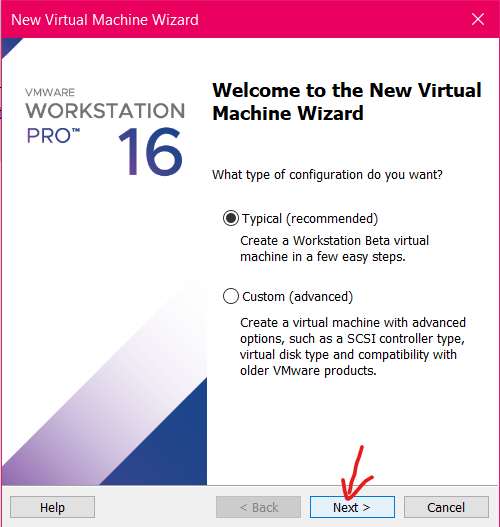

# CÁCH CÀI UBUNTU SERVER TRÊN VMWARE #
## Bước 1: ##
### Tải Ubuntu Server ISO file từ trang web chính thức của Ubuntu ###

Để download Ubuntu Server bạn vào địa chỉ:  
https://ubuntu.com/download/server/thank-you?version=24.04.1&architecture=amd64&lts=true
 
Nhấn vào **download now**

## Bước 2: ##
### Tạo một máy ảo mới trên VMware ###
  
Chọn next:  

Chọn Browse và tìm đến file vừa tải về   
  
Mở thư file vừa tải về lên   
  
Rồi nhấn next  
Tạo User  
  
Ví dụ:  
  
Rồi nhấn next:  
  
Sang phần Tên máy ảo   
  
tôi đặt tên là UbuntuServer rồi nhấn next  
  
Chọn dung lượng ổ đĩa, tôi sẽ để là 25 GB rồi nhấn next  
  
Nhấn Finish

**Tạo mới máy ảo hoàn thành**
### Cấu hình cho Ubuntu Server ###

Vào Ubuntu Server chọn **Try or Install Ubuntu Server**

Chọn Ngôn ngữ và nhấn Enter  

Ở giao diện này nhà phát hành thông báo đã có phiên bản cập nhật   
Ở đây có 3 sự lựa chọn  
- Cập nhật bản cài đặt mới  
- Tiếp tục mà không cần cập nhật
- Quay lại
  
Tôi sẽ chọn **Tiếp tục mà không cần cập nhật**  

Ở màn hình này sẽ cấu hình bàn phím, tôi sẽ để mặc định bàn phím là Anh Mỹ và nhấn **Done**.  

Đến màn hình kế tiếp , sẽ chọn kiểu cài đặt và có 2 sự lựa chọn  
- Ubuntu Server  
- Ubuntu Server (mininstall)(phiên bản thu nhỏ)  
Tôi sẽ chọn Ubuntu Server và nhấn **Done**  
  
Tiếp đến là cấu hình mạng  
Tôi để mặc định và nhấn **Done**  
Tiếp đến là cấu hình Proxy
  
Tiếp tục nhấn **Done**
Cấu hình nhân bản lưu trữ 
  
Tiếp tục nhấn **Done**

Thiết lập cấu hình lưu trữ có hướng dẫn. Các bạn để mặc định rồi nhấn **Done**

Tiếp đến là cấu hình lưu trữ , vẫn để mặc điijnh và nhấn **Done**  
Một thông báo hiện lên xác nhận quá trình và không thể quay lại khi nhấn **Continue**

Nhấn Continue để tiếp tục  
  
Cấu hình User 
Nhập username và password  
  
Nhấn Done:
  
Nâng cấp lên Ubuntu Pro  
Các bạn có thể nâng cấp lên Ubuntu Pro. Nhưng tôi sẽ chọn tạm thời bỏ qua và nhấn **Continue**  

Tiếp đến sẽ nhấn để chọn cài đặt ssh và nhấn **Done**    

Chọn môi trường phổ biến trên máy chủ.Tôi sẽ chọn vài cái rồi nhấn **Done**  
  
Chờ để cài đặt hệ thống  
Sau khi Hoàn thành cài đặt  
  
Chọn **Reboot Now** để khởi động lại và chờ.  

  
Sau khi chờ sẽ lên màn hình đăng nhập vào. Nhập username và password hồi nãy vừa tạo.  
  
Lên như này là đã hoàn thành cài đặt Ubuntu Server

