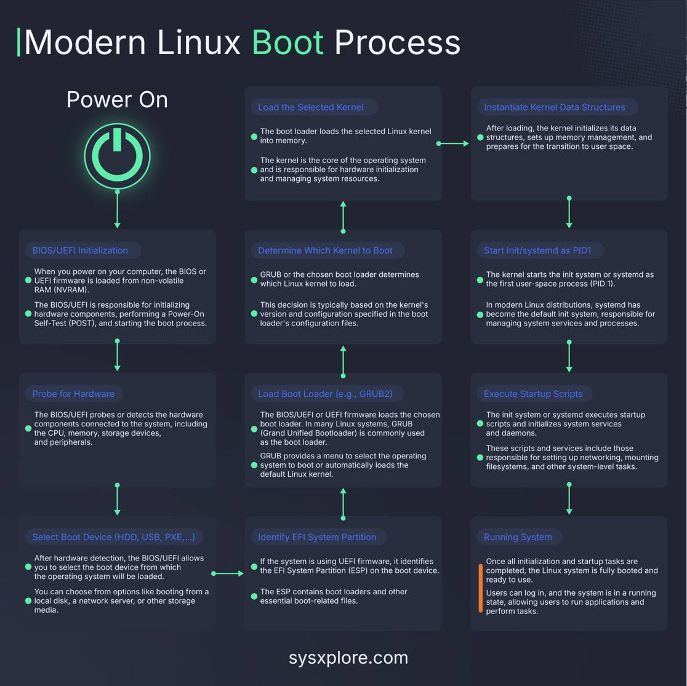

# Quá Trình khởi động của hệ điều hành Linux #

  
**Chi tiết các bước:**  
## 1. Power On: ##
    Khi bạn bật máy tính, BIOS hoặc UEFI được nạp từ bộ nhớ không dễ biến (NVRAM).
## 2. BIOS/UEFI Initialization: ##
    BIOS/UEFI chịu trách nhiệm khởi chạy các thành phần phần cứng, thực hiện Kiểm tra Bật nguồn tự động (POST) và bắt đầu quy trình khởi động.
## 3. Probe for Hardware: ##
    BIOS/UEFI phát hiện hoặc kiểm tra các thành phần phần cứng kết nối với hệ thống như CPU, bộ nhớ, thiết bị lưu trữ và các thiết bị ngoại vi khác.
## 4. Select Boot Device (HDD, USB, PXE,...): ##
    Sau khi phát hiện phần cứng, BIOS/UEFI cho phép chọn thiết bị khởi động mà hệ điều hành sẽ được tải từ đó.  
    Các tùy chọn có thể là đĩa cứng cục bộ, máy chủ mạng, hoặc các phương tiện lưu trữ khác.
## 5. Identify EFI System Partition:##
    Nếu hệ thống đang sử dụng firmware UEFI, nó xác định phân vùng Hệ thống EFI (ESP) trên thiết bị khởi động.  
    ESP chứa các boot loader và các tập tin liên quan đến khởi động khác.  
## 6. Load Boot Loader (e.g., GRUB2):##
    Firmware BIOS/UEFI hoặc UEFI tải boot loader đã chọn.  
    Trong nhiều hệ thống Linux, GRUB (Grand Unified Bootloader) thường được sử dụng làm boot loader.  
    GRUB cung cấp menu để chọn hệ điều hành nào để khởi động hoặc tự động tải kernel Linux mặc định.  
## 7. Determine Which Kernel to Boot:##
    GRUB hoặc boot loader đã chọn xác định kernel Linux nào sẽ được tải.  
    Quyết định này thường dựa trên phiên bản và cấu hình của kernel trong tệp cấu hình của boot loader.  
## 8. Load the Selected Kernel:## 
    Boot loader tải kernel Linux đã chọn vào bộ nhớ.
## 9. Instantiate Kernel Data Structures:##
    Sau khi được tải, kernel khởi tạo cấu trúc dữ liệu của nó, thiết lập quản lý bộ nhớ và chuẩn bị chuyển sang không gian người dùng.
## 10. Start init/systemd as PID1:##
    Kernel bắt đầu hệ thống init hoặc systemd như tiến trình không gian người dùng đầu tiên (PID 1).  
    Trong các bản phân phối Linux hiện đại, systemd đã trở thành hệ thống init mặc định, chịu trách nhiệm cho việc quản lý dịch vụ hệ thống và các tiến trình.
## 11. Execute Startup Scripts:##
    Hệ thống init hoặc systemd thực thi các tập lệnh khởi động và khởi tạo các dịch vụ hệ thống và các demon.  
    Những tập lệnh và dịch vụ này bao gồm các công việc như thiết lập mạng, gắn file system, và các tác vụ hệ thống cấp cao khác.
## 12. Running System:##
    Một khi tất cả các công việc khởi tạo và khởi động hoàn tất, hệ thống Linux đã hoàn toàn khởi động và sẵn sàng để sử dụng.  
    Người dùng có thể đăng nhập, và hệ thống đang ở trạng thái chạy, cho phép người dùng chạy ứng dụng và thực hiện các tác vụ. Quá trình này giúp đảm bảo rằng mọi thành phần cần thiết cho hoạt động của hệ điều hành Linux được tải đúng cách và theo thứ tự hợp lý, từ việc phát hiện phần cứng đến việc chạy đầy đủ hệ điều hành.